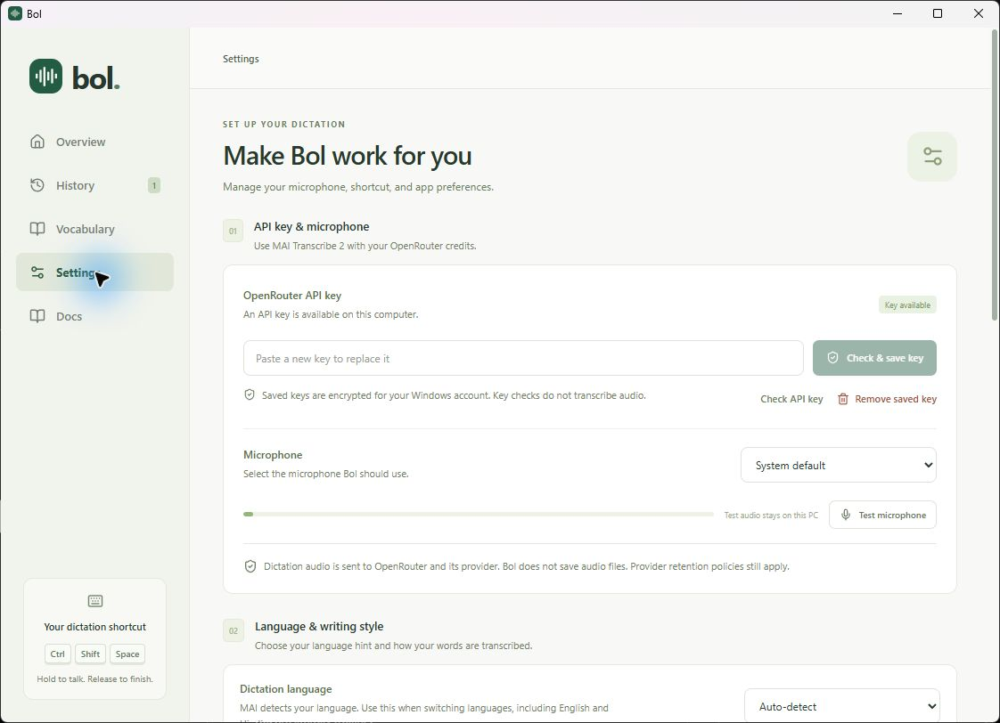
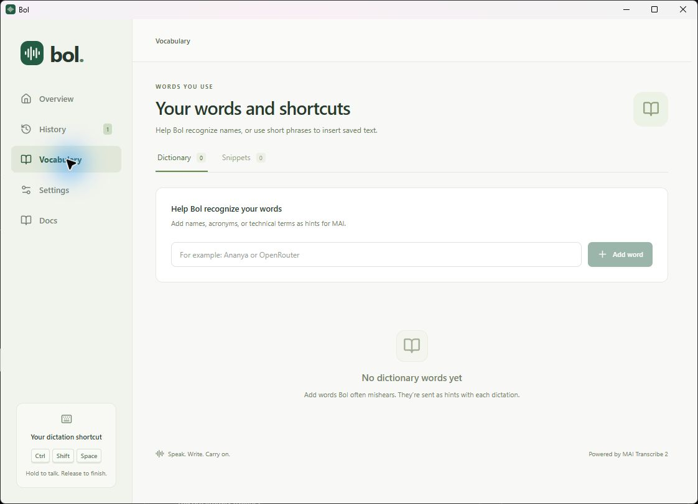
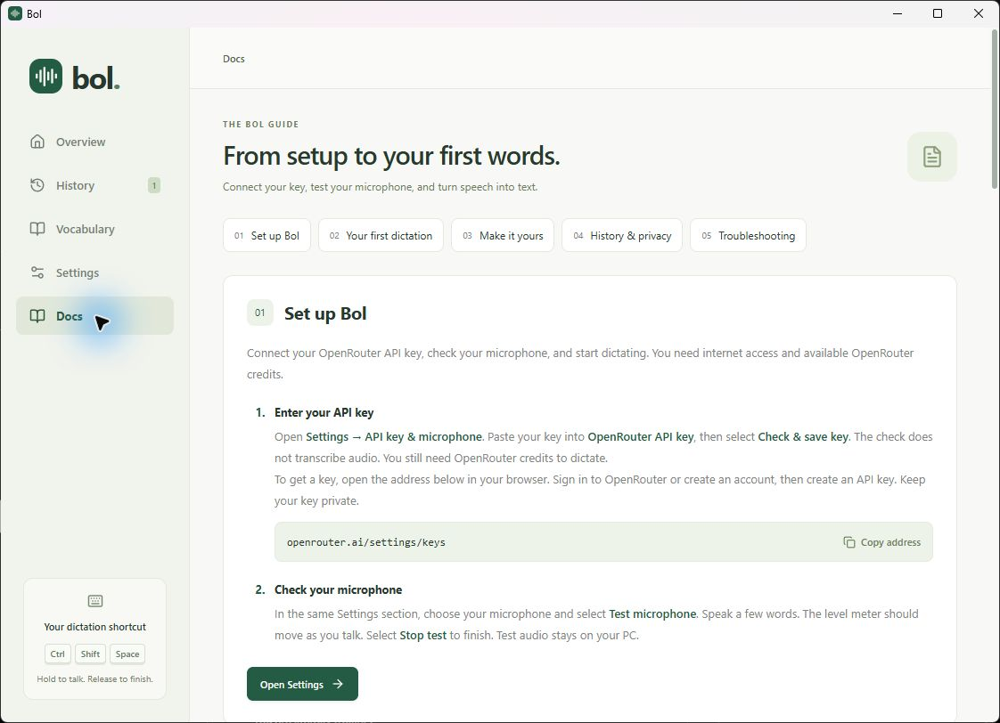

# Bol

A personal Windows dictation app. Hold **Ctrl + Shift + Space**, speak, and release to insert the result at your cursor. Press **Escape** to cancel.

Bol is free, open-source software under the [MIT license](LICENSE). There is
no Bol subscription or Bol account. Transcription requires your own OpenRouter
API key, internet access, and paid provider credits. The hosted transcription
model is not part of Bol's open-source code.

Bol uses **MAI Transcribe 2 through OpenRouter**. MAI is the only model used by the app. Dictation language defaults to Auto-detect; select one of MAI's 60 supported languages in Settings to send a language hint. The transcription keeps the writing system returned by MAI.

## Screenshots

Screenshots of Bol v1.0.0 on Windows in Light appearance.

**Settings** — configure your API key, microphone, and dictation language.



<details>
<summary>Vocabulary and built-in guide</summary>

**Vocabulary** — add recognition hints for names and technical terms.



**Docs** — follow the setup guide inside the app.



</details>

## Install and start

1. Download and run [`Bol_1.0.0_x64-setup.exe`](https://github.com/gruzker/Bol/releases/download/v1.0.0/Bol_1.0.0_x64-setup.exe) from [Bol v1.0.0](https://github.com/gruzker/Bol/releases/tag/v1.0.0). For portable use, extract [`Bol_1.0.0_windows-x64.zip`](https://github.com/gruzker/Bol/releases/download/v1.0.0/Bol_1.0.0_windows-x64.zip). Locally prepared files are in `release/`. The installer is unsigned.
2. Open Bol → **Settings**. Enter your OpenRouter API key and select **Check & save key**. This checks the key without making a paid transcription request.
3. Select your microphone, then use **Test microphone**. Speak briefly and finish the test; test audio is never uploaded.
4. Click a text field in another app. Hold **Ctrl + Shift + Space**, speak, then release. Alternatively, select the start/stop recording mode in Settings.

Bol stays in the system tray when its window closes. Left-click its tray icon to reopen it; right-click for **Quit Bol**. Recordings have a five-minute limit. Internet access and sufficient OpenRouter credits are required for dictation.

**Start dictation** in the Overview screen records into Bol and provides a Copy button. The global shortcut sends text to the app you were using. If your cursor changes while processing, the transcript stays available to copy. Copying is explicit; automatic insertion leaves your clipboard untouched. Bol never sends an Enter key to submit your messages.

## Appearance

Open **Docs** in the sidebar for the complete guide: OpenRouter key setup, microphone testing, first dictation, preferences, vocabulary, history, privacy, updates, and troubleshooting. The guide follows your saved shortcut and recording/insertion settings and is included in the app. Its OpenRouter setup instructions were checked against the [official OpenRouter FAQ](https://openrouter.ai/docs/faq).

In **Settings → Appearance & storage → Appearance**, choose Light, Dark, or System. The preference is saved locally. System follows the Windows appearance; the small dictation icon keeps its transparent background.

## Dictation icon

A small animated icon responds to your voice. In **Settings → Shortcut & dictation → Dictation icon position**, choose top, bottom, left, right, center, or a corner. The icon appears on the monitor containing your cursor and stays inside its usable work area.

## Languages and personalization

- **Dictation language:** Auto-detect lets MAI identify the language, including mixed English and Hindi. Select any of the 60 listed languages to send a specific language hint. This does not translate or convert the writing system.
- **Clean & readable:** asks MAI to remove fillers and format speech. **As spoken:** asks for verbatim speech.
- **Dictionary:** up to 100 names or terms, sent to MAI as recognition hints.
- **Snippets:** speak a complete saved trigger by itself to expand it. `my email` can insert an address; `send this to my email` does not accidentally expand it.

## Storage and privacy

- The key is encrypted with Windows DPAPI for your current Windows account, under `%LOCALAPPDATA%\local.bol.desktop\openrouter.key`. It is not written into JavaScript, settings JSON, or logs.
- Preferences and optional history are in `bol.sqlite` in that same folder.
- History is **off by default**. When enabled, Bol keeps the latest 500 dictations locally. Turning history off does not delete existing entries; use **Clear history** to delete them. SQLite secure deletion is enabled.
- Audio exists temporarily in memory, and is released after completion or cancellation. There is no recording archive.
- Real dictation sends audio to OpenRouter and its transcription provider. Their retention policies still apply; local deletion is not a claim of zero provider retention.
- No telemetry, accounts, subscription system, or hosted Bol backend.

## Known limitations

- Results arrive after recording finishes; live streaming partial transcripts are not implemented.
- Windows can block input into elevated applications, protected fields, or custom editors. Unicode insertion is best-effort; inspect the destination before copying after a partial-input error. A successful Windows input call does not prove a particular editor accepted every character.
- Foreground window, focused native control, and native caret changes suppress insertion. Some browser/custom controls do not expose distinct native focus/caret state. Cursor movement inside such an app may not be detectable.
- The app does not read your screen, application content, or selection for rewriting context.
- There is no offline transcription, meeting recorder, mobile app, sync, or automatic updater.
- Removing the saved key does not remove an externally configured `OPENROUTER_API_KEY` environment variable. The environment variable is supported for development.
- The installer is unsigned and can trigger a Windows reputation prompt. Signing is not configured.

## Develop

Requirements: Node.js 22+, Rust stable, Visual Studio C++ Build Tools, and Microsoft Edge WebView2 Runtime.

```powershell
npm ci
npm run tauri -- dev
```

If Rust is installed but not in PATH:

```powershell
$env:PATH = "$env:USERPROFILE\.cargo\bin;" + $env:PATH
```

`npm run dev` alone runs an honest, read-only browser interface preview; it does not record or pretend to save native preferences.

```powershell
npm run build
npm test
cd src-tauri
cargo test --lib
cargo clippy --all-targets -- -D warnings
```

Before running `npm test`, start `npm run dev` in another terminal. Browser tests expect the Vite server at `http://127.0.0.1:1420` and use an installed Microsoft Edge in headless mode. `tests/native-smoke.mjs` exercises a debug app's real IPC through a localhost WebView2 debugging port (see comments in that script); this port is not enabled in the packaged app. Use a disposable test account for native smoke tests because they temporarily change preferences.

Build an installer:

```powershell
npm run tauri -- build
```

The output is in `src-tauri\target\release\bundle\nsis`.

## License and contributions

Copyright (c) 2026 Sanjay Ahlawat. Bol's own code is licensed under MIT;
dependencies retain their original licenses. See [third-party notices](THIRD_PARTY_NOTICES.md),
[contribution instructions](CONTRIBUTING.md), and [security reporting](SECURITY.md).

## Preparing future releases

[Bol v1.0.0](https://github.com/gruzker/Bol/releases/tag/v1.0.0) is published. For future releases:

1. Review private vulnerability reporting settings and confirm ownership or
   permission for submitted code and assets.
2. Commit source, configuration, tests, license notices, and lockfiles. Keep
   ignored credentials, local data, build outputs, and release binaries out of Git.
3. Test the installer/upgrade and real dictation in target Windows editors.
4. Tag the reviewed source with the next version and create a matching release. Attach the
   installer and the standalone distribution ZIP containing the executable,
   MIT license, and third-party notices. Preserve these notices in redistributions.
5. Link the website to that repository, its license, releases, and issue tracker.
   State clearly that the app is free but OpenRouter usage is paid.

Regenerate notices after dependency changes with Python 3.11+:
`python scripts/generate-notices.py`. Run after `npm ci` and `cargo fetch
--manifest-path src-tauri/Cargo.toml --locked`; Cargo must be in PATH.
The installer bundles the license and notices as resource files. Rebuild
release artifacts after changing licenses or packaging configuration.

## Sources

- [OpenRouter MAI Transcribe 2](https://openrouter.ai/microsoft/mai-transcribe-2)
- [OpenRouter transcription contract](https://openrouter.ai/docs/guides/overview/multimodal/stt)
- [Windows SendInput limitations](https://learn.microsoft.com/en-us/windows/win32/api/winuser/nf-winuser-sendinput)

